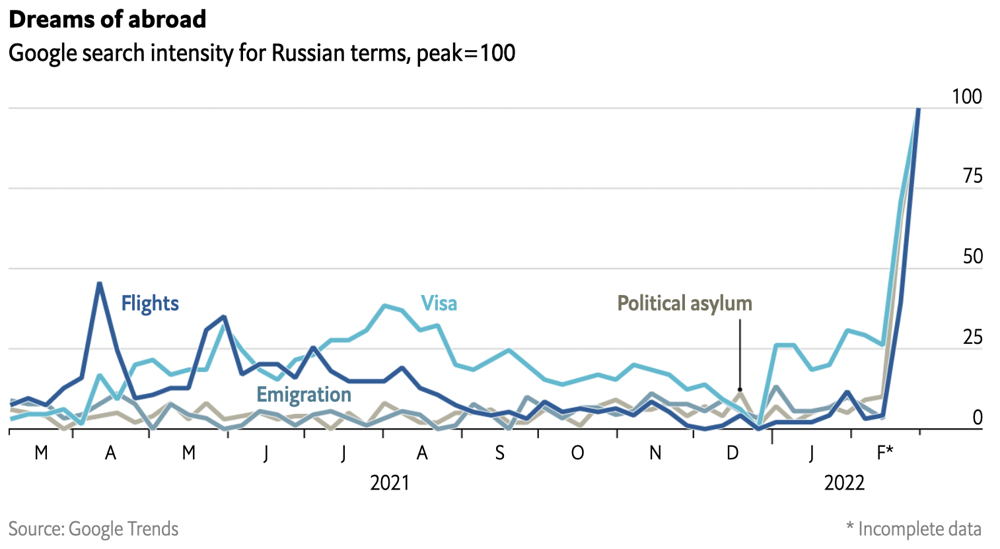
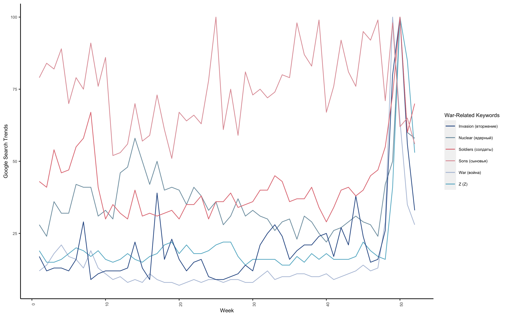
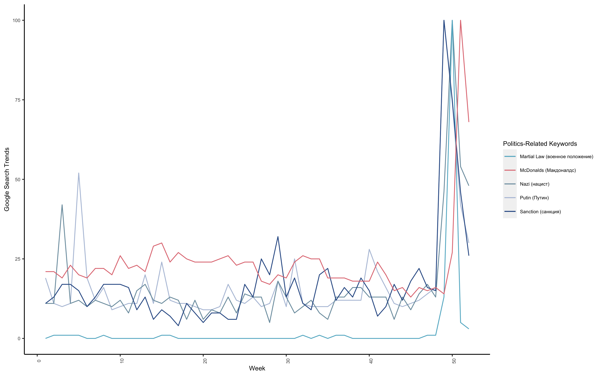
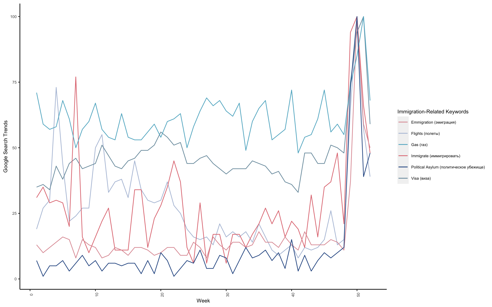
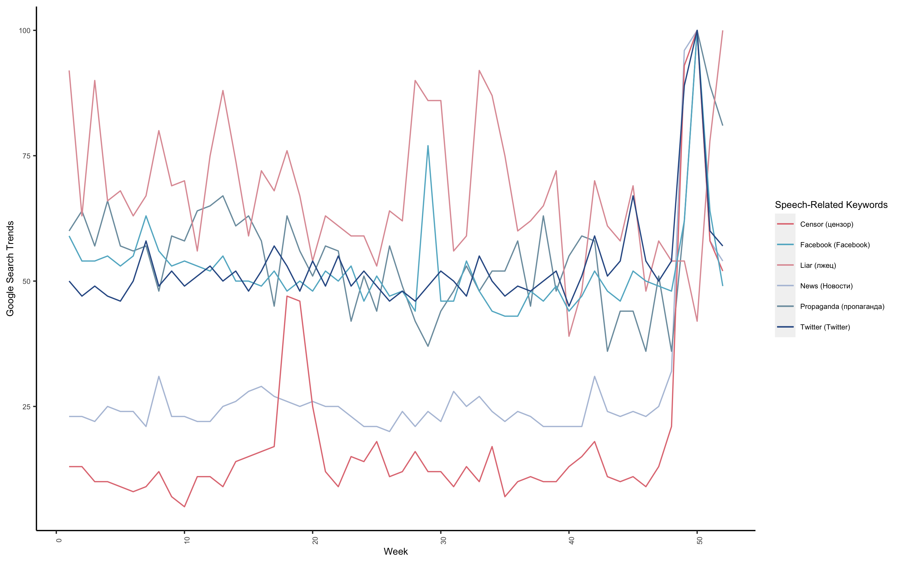
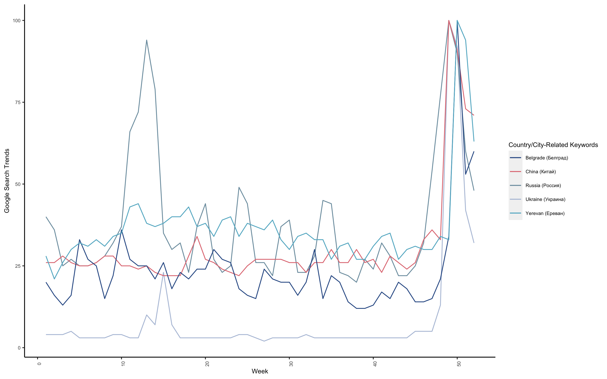

<h1>Data Visualization:  What Are People in Russia Searching on Google?</h1>

Author: Nicole Golden  Date: March 18, 2022 

        

 
On March 5, The Economist publish an article titled "Russians are trying to flee Putin’s chaos" along with a plot below (see Figure 1). This plot was created using Google Trends data. The graph sends an alarming message: there is no war inside Russia, but the people inside the country getting out. Even though President Putin is shutting down free media inside the country, some people are still getting the real news through other resources.   
   

       

            

<h6>Figure 1 (Image Source: <a href="https://www.economist.com/graphic-detail/2022/03/04/russians-are-trying-to-flee-putins-chaos?utm_medium=social-media.content.np&utm_source=twitter&utm_campaign=editorial-social&utm_content=discovery.content" target="_blank">The Economist</a>) 
</h6>

                

    
Inspired by this article, I decided to do some data visualization by expanding the keywords searched on Google in Russia. That said, the searches are not only by Russian people but also by foreigners who reside in Russia. The original article includes only four keywords: flights, emigration, visa, political asylum (The data is from March 2021 to February 2022). In addition to these four keywords, I added extra words that may be of people's interest in Russia triggered by the war in Ukraine, and I grouped these words into six categories:  
(1) War-related;  
(2) Money-related;  
(3) Politics-related;  
(4) Immigration-related;  
(5) Speech-related;  
(6) Country/City-related.

  
                
For each keyword, I also attached the Russian version alongside (correct me if the Russian words are wrong). The data is collected from <a href="https://trends.google.com/trends/?geo=US">Google Trends</a> and from period March 2021 to March 2022. At a glance, all the keywords spiked once the war broke out in Ukraine. Some of the results show abnormalities pre-war time; some already have high searches before the war. I will try to explain the plots in the rest of the article.     

            

<h6>Figure 2 (Image Source: Nicole Golden. Data Source: 
<a href="https://trends.google.com/trends/?geo=US" target="_blank">Google Trends</a>) 
</h6>

            

    
In Figure 2, people searched general terms related to war such as "war," "nuclear," and "soldiers." "Invasion" is a <a href="https://www.npr.org/2022/03/05/1084729579/russian-law-bans-journalists-from-calling-ukraine-conflict-a-war-or-an-invasion" target="_blank">banned</a> by Russian law. If journalists cannot use this term, Russian residents are definitely getting real news from other sources such as VPN, friends or relatives. The Guardian reported that more than <a href="https://www.theguardian.com/world/2022/mar/18/ukraine-russia-families-divided-over-war" target="_blank">20 million</a> Ukrainians have family in Russia (This number may be conservative since this was estimated in <a href="https://rb.com.ua/blog/rossija-glazami-ukraincev/" target="_blank">a survey</a> in 2011). Term "Z" is a new term that gained fresh popularity out of this war. You can look at this <a href="https://en.wikipedia.org/wiki/Z_(military_symbol)" target="_blank">Wikipedia</a> page to get a general idea.   

            

<h6>Figure 3 (Image Source: Nicole Golden. Data Source: 
<a href="https://trends.google.com/trends/?geo=US" target="_blank">Google Trends</a>) 
</h6>

            

    
Following the war, US and EU imposed severe economic <a href="https://www.bloomberg.com/news/articles/2022-02-28/sanctions-imposed-so-far-on-russia-from-the-u-s-eu-and-u-k" target="_blank">sanctions</a> against Russia (see Figure 3). People are very aware of it since it affects their daily lives. Putin's name was searched a lot since he decided the war. The search on "Nazi" also shoots up. This may be related to Putin's claim on Ukraine's "<a href="https://www.nbcnews.com/think/opinion/ukraine-has-nazi-problem-vladimir-putin-s-denazification-claim-war-ncna1290946" target="_blank">Nazi problem</a>" (which is a false claim, of course). People are also concerned to live under "Martial law," which will make normal people's life even harder (see <a href="https://en.wikipedia.org/wiki/Martial_law" target="_blank">Wikipedia</a> for its definition). Many western companies are leaving Russia, including beloved McDonald's. This <a href="https://www.youtube.com/watch?v=ckbfS99N6jY" target="_blank">video</a> shows the first launch of McDonald's in 1990. People queued hours outside in the cold winter just to take a bite of its juicy burger. After McDonald's also announced its departure, people flocked to restaurant to get a <a href="https://tatvabodhini.com/russians-grab-their-last-meal-at-mc-donalds-as-it-announces-shutdown/" target="_blank">last bite</a>.       

<h6>Figure 4 (Image Source: Nicole Golden. Data Source: 
<a href="https://trends.google.com/trends/?geo=US" target="_blank">Google Trends</a>) 
</h6>

            

  
(Figure 4) There came the sanction. Then there came the money problem. Rouble value <a href="https://www.reuters.com/business/russian-rouble-tumbles-record-low-2022-02-28/" target="_blank">tumbled</a>; people go to <a href="https://www.reuters.com/world/europe/russians-queue-cash-west-targets-banks-over-ukraine-2022-02-27/" target="_blank">banks</a> wishing to secure some money/cash, or exchange some dollars to secure its values. Then there came the troubled <a href="https://www.reuters.com/world/europe/russian-inflation-accelerates-125-highest-since-2015-2022-03-16/" target="_blank">inflation</a>, which is at a 12.5% rate of increase as of March 16.   

         

<h6>Figure 5 (Image Source: Nicole Golden. Data Source: 
                <a href="https://trends.google.com/trends/?geo=US" target="_blank">Google Trends</a>) 
</h6>

  
(Figure 5) Then there is the exodus: as many as <a href="https://www.bbc.com/news/world-europe-60697763" target="_blank">200,000 Russians</a> are leaving the country. Many young people inside the country are <a href="https://qz.com/2135871/do-russians-support-war-with-ukraine/" target="_blank">against the war</a>. They are worried about the future of their county and of themselves. They decided to leave for a foreign country, despite not knowing anyone or not having a job. 

            

            

<h6>Figure 6 (Image Source: Nicole Golden. Data Source: 
                <a href="https://trends.google.com/trends/?geo=US" target="_blank">Google Trends</a>) 
</h6>

            

 
(Figure 6) The Russian government is fighting a war that people see differently because the government is shutting down social media - Facebook, Twitter, one by one. People who have means know it is "propaganda" or "censor(ed)." The term "liar" has an interesting pattern: before the war broke out, it was already a popular term (though it has its ups and downs); then, it peaked when the war started. It is not clear to me which side people are accusing.  

            

            

<h6>Figure 7 (Image Source: Nicole Golden. Data Source: 
                <a href="https://trends.google.com/trends/?geo=US" target="_blank">Google Trends</a>) 
</h6>

 
                 (Figure 7) Naturally, "Russia" and "Ukraine" are searched more frequently after the war. As Russia's ally, "China" also appeared more times in the searches. The other cities, "Belgrade" and "Yerevan," are two popular destinations that Russians are fleeing to. 

               

 
At the end of the article, I'd like to share a website <a href="https://papapover.com/en/" target="_blank">Dad, believe</a> made by a Ukrainian man <a href="https://www.nytimes.com/2022/03/06/world/europe/ukraine-russia-families.html" target="_blank">Misha Katsurin</a>. He created this website because of similar experiences of other Ukrainians: their family in Russia <a href="https://www.theguardian.com/world/2022/mar/18/ukraine-russia-families-divided-over-war" target="_blank">don't believe</a> there is such a war (since the war-related news reported in Russia is not truthful). I just hope Ukrainians have their peace soon. 

    

